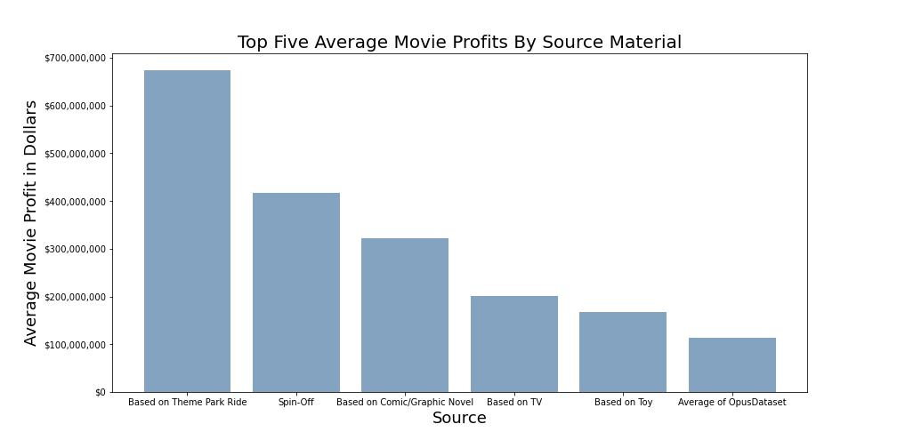

# Microsoft Corp. Movie Studio Analysis 

Author: Emily Marsh

## Overview

This project analysis was done on box office records and investigates  how different movie attributes affect profitability. This analysis was requested by Microsoft which would like to start their own movie production company. 

## Business Problem

Microsoft is interested in branching into movie production but before investing capital would like to determine which movie attributes could provide the biggest chance of profit. Using the data, this analysis will provide insight into content recommendations for potential profit.

## Data

The Opus Dataset is an external data set that includes 1900 entries of movies produced between 2006 to 2018 with budgets at or over 10 million dollars. In each entry, information about budget, domestic box office gross, international box office gross, run time, genre, and source material was provided.

## Methods

This project defined each movie’s profit as total domestic and international box office minus production budget. Movies were grouped by source material, genre, and rating and each group’s set of parameters was then ordered by average movie profit. Average profit was used as opposed to total profit within each group to more accurately distribute results, as some group parameters (ex. genre) have more entries in one area than another. One additional primary assumption was that the profit calculation did not including marketing, advertising, and other costs outside of production.

## Results

Overall the dataset shows that movies with higher budgets tend to make more profit at the box office. It is also important to note that from 2006 to 2018 the percentage of international box office revenue increased. According to this dataset, on average the chance that a movie would turn a profit is 77% and the average profit of each movie is roughly $130,000,000. However, when grouping the movies by certain characteristics, it was found that there are certain types of movies that have an impact on the probability of profit. 

When we look at average movie profits grouped by source material we see that the top five source materials exceed the average profit per movie significantly. 

Genre also has a significant effect on movie profitability. Overall musicals and and adventure films show the biggest profit on average.

Lastly, when grouped by rating, more family friendly movies by rating (G, PG and PG 13) show both the biggest average profit per movie, as well as a high probability for profit

These three recommendations will help Microsoft minimize risk and maximize profit on future movie productions.

## Conclusions

Most movies with big budgets generate some amount of return, however certain aspects of movies can significantly increase the probability of profit. Since a movie production can require a significant amount of initial investment, maximizing the chances that a movie will return on that investment is critical to the success of a young production company.

Microsoft will maximize their probability of profit by following these three recommendations.

	1.	Create movies that have a rating of G, PG and PG 13
	2.	Create movies that are based on an existing product or franchise
	3.	Develop movies that are in the Musical, Adventure or Action genres

## Moving Forward

To discover additional movie aspects that could affect probability of profit, Microsoft could further explore the following topics.

	1.	Add the cost of marketing both domestically and internationally to understand it's effect on overall profit
	2.	Conduct additional research into popularity of lead actors and directors on movie profitability
	3.	Add additional movies into the database to see if findings continue to be true in a bigger dataset

## For More Information

The full analysis and process by which these conclusions were reached can be found in the Jupyter notebook or by reviewing the summary presentation.

For additional questions, contact Emily Marsh: marshemily2@gmail.com

## Repository Structure

  |── data
├── images
├── README.md
├── FI - Phase 1 Project.pdf
└── phase_1_project.ipynb
